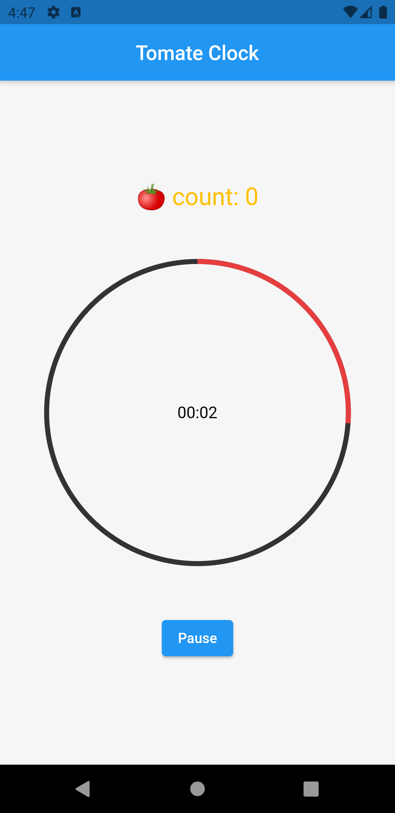
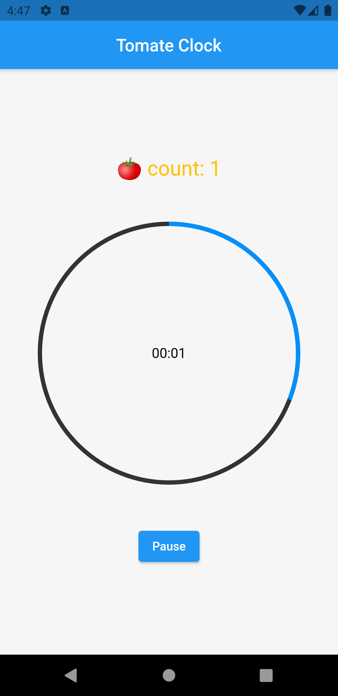
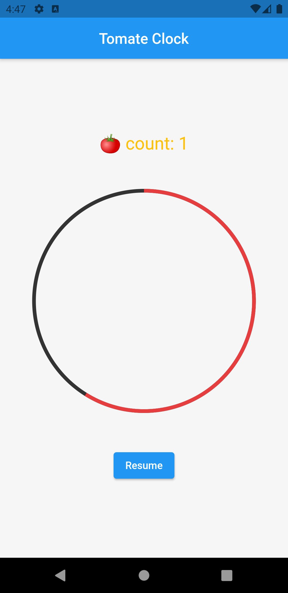

# tomate_clock

A pomodoro app made with Flutter. Used [**circular_countdown_timer**](https://pub.dev/packages/circular_countdown_timer) package to display the timer. A pomodoro duration is 25 minutes, short break duration is 5 minutes and after every four short break duration there is a long break which runs for 30 minutes.

## Features to add
1. Local storage to store daily pomodoro count
2. Project or task selection 
3. Online storage using Firebase

## Screenshots

| Pomodoro  | Break | Pause |
| ------------- | ------------- | -------------|
|  |   | 
